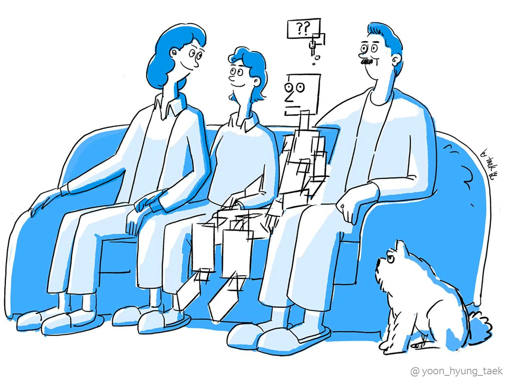

# Workshop on Understanding, Mitigating, and Leveraging Cognitive Biases to Calibrate Trust in Evolving AI Systems

*A Workshop at [CHI 2026](https://chi2026.acm.org/) in Barcelona, Spain (April 13-17, 2026)*

{% include figure.html img="forward-thinking-illustration.png" alt="biases in emerging AI" caption="Image by Hyung Taek Yoon" width="75%" %}

Despite decades of advancements in Artificial Intelligence (AI), fostering appropriate trust in AI systems remains a challenge. Cognitive biases — systematic deviations from rational judgement — profoundly influence human decision-making, and reliance on such "mental shortcuts" can make AI systems appear more or less trustworthy than they really are, often undermining collaboration outcomes. As AI evolves with more sophisticated and persuasive natural language outputs, particularly through Generative AI (GenAI) and Large Language Models (LLMs), these biases may manifest in new and unpredictable ways, calling for their comprehensive examination. This workshop builds on a series of prior workshops at [CSCW '23](https://dl.acm.org/doi/abs/10.1145/3584931.3611284), [Dagstuhl Seminar 22172](https://www.dagstuhl.de/seminars/seminar-calendar/seminar-details/22172), [CHI '21](https://dl.acm.org/doi/abs/10.1145/3411763.3441350), and [CHI '20](https://dl.acm.org/doi/abs/10.1145/3334480.3375159), which examined the design of technologies that support human cognition and decision-making through the lens of cognitive biases. While these earlier workshops established the importance of recognising biases in decision-making, this proposed workshop extends the conversation to the specific and timely context of trust calibration in AI systems, particularly in light of emerging paradigms such as Generative AI and LLMs. As a specialised extension, it represents the continuation of an established HCI research agenda, while also advancing it to proactively shape how cognitive biases are understood, mitigated, and leveraged in the design of trustworthy AI systems.

# Workshop Topics

We put forth three focused topics sitting at the intersection of cognitive biases and trust calibration in AI systems. Each topic addresses a critical challenge in aligning human trust with AI capabilities, while accounting for the realities of human cognition.

## Topic I: Understanding and Mapping Biases in Human–AI Interaction
Despite decades of research, the ways cognitive biases shape user trust and reliance in AI systems remain under-characterised, and are also consistently evolving as AI evolves. Scholars also argue that there is a plethora of systematic effects not accounted for as cognitive biases. 

**We ask:** In what ways can cognitive biases manifest in human–AI interaction across domains and tasks (e.g., structured decision support vs. conversational LLM settings)? Where do biases typically arise in the human–AI interaction pipeline? How are these biases currently operationalised in research, or where might their role be overlooked? What patterns of over- and under-reliance emerge as a result of these biases? Can behaviours observed in existing empirical human–AI research be explained, at least in part, through these heuristics and biases? To support this mapping, we urge participants to draw on established cognitive bias clusters such as *Too Much Information*, *Not Enough Meaning*, *Need to Act Fast*, and *Memory Limitations*. These clusters can be found [here](https://www.sog.unc.edu/sites/www.sog.unc.edu/files/course_materials/Cognitive%20Biases%20Codex.pdf), and a cheat sheet [here](https://buster.medium.com/cognitive-bias-cheat-sheet-55a472476b18).

## Topic II: Design Strategies — Mitigating Biases and Leveraging Heuristics
This topic considers how to effectively respond to biases through meaningful design, without falling into overly corrective approaches or those that sacrifice user agency or experience.

**We ask:** What interventions (e.g., transparency scaffolds, system framing, delays before seeing AI response, just-in-time cues, or behavioural “nudges”) could mitigate the harmful effects of biases without undermining user autonomy, understanding, or accuracy? What are some design tensions at play here, and what ethical trade-offs emerge? When and (should) cognitive biases and heuristics be harnessed to improve trust calibration? How can we design AI systems with cognitive biases and heuristics in mind? What novel design solutions could LLMs offer to mitigate/leverage cognitive biases?

## Topic III: Methods and Case Studies
Studying how biases and heuristics shape trust is methodologically complex: these phenomena are often tacit and context-sensitive. The HCI community lacks a common standard to study cognitive biases. This topic invites reflection on how best to empirically capture, quantify, or observe trust miscalibration driven by biases — whether in the lab or even in the wild. 

**We ask:** What tools, study designs, measures, and signals may capture, quantify, or observe bias-driven trust dynamics? What blind spots exist in our empirical approaches today, and what would more robust, ecologically valid, and interdisciplinary approaches entail?

# Workshop Goal
This 90–minute workshop invites diverse researchers from HCI, human–centred AI, cognitive psychology, interaction design, and related fields to collaboratively explore how cognitive biases influence trust calibration in human–AI interaction and establish a research agenda. We will explore how biases emerge across the human–AI interaction pipeline, what design strategies can mitigate or even harness these heuristics, and what methods are needed to study these dynamics effectively. Through a highly interactive 90-minute session, participants will map out open challenges, brainstorm tensions and solutions, chart future research directions, and share perspectives from their own diverse disciplinary lenses. Through this workshop, we aim to build a shared understanding of how cognitive biases influence trust in evolving AI systems, and derive a forward-looking, bias-aware research agenda that promotes appropriate trust in human–AI interaction.

# Participation

* Submission Deadline: March 1, 2026, 11:59 PM (Anywhere on Earth)
* Notification: March 21, 2026
* Workshop Date: TBA (April 13-17, 2026)

> **NOTE:** There is no additional Cost for Participation — CHI 2026 workshops are included with [conference registration](https://chi2026.acm.org/attendees/registration/) and do not require an additional fee for attendees.

We invite participants to submit a contribution in one of the following forms: 
* an essay (1–2 pages) stating their research background and motivation for attending this workshop
* a short / abridged paper (2–4 pages excluding references) presenting research contributions that align with one or more of the workshop topics. 

Submissions should follow [the CHI Extended Abstract template](https://chi2026.acm.org/chi-publication-formats/), using a single-column format, and will be reviewed by the organising committee based on relevance to the workshop topics and diversity of perspectives.

Please submit via the Google form: [https://forms.gle/8gCa1TAffyNEyA2T9](https://forms.gle/8gCa1TAffyNEyA2T9)

For inquiries regarding the workshop, please reach out to [bias4trust.chiws@gmail.com](mailto:bias4trust.chiws@gmail.com)

# Organisers
* Saumya Pareek (University of Melbourne)
* Nattapat Boonprakong (National University of Singapore)
* Naja Kathrine Kollerup (Aalborg University)
* Si Chen (University of Notre Dame)
* Simo Hosio (University of Oulu)
* Koji Yatani (University of Tokyo)
* Yi-Chieh (EJ) Lee (National University of Singapore)
* Ujwal Gadiraju (Delft University of Technology)
* Niels van Berkel (Aalborg University)
* Jorge Goncalves (University of Melbourne)

This text will appear to the right of the image and wrap around it as it gets longer.

  

This text will appear below the image and the wrapped text.

 
> built using [Jekyll](https://jekyllrb.com/) and [GitHub Pages](https://pages.github.com/)
> 
